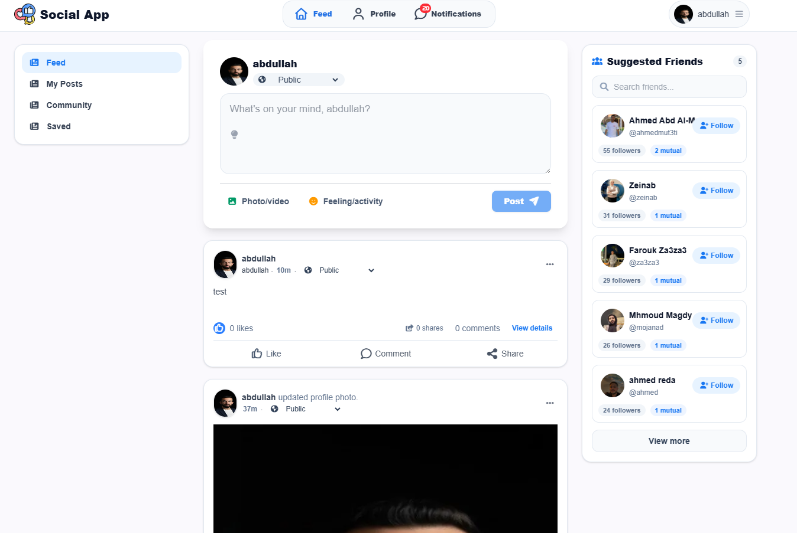
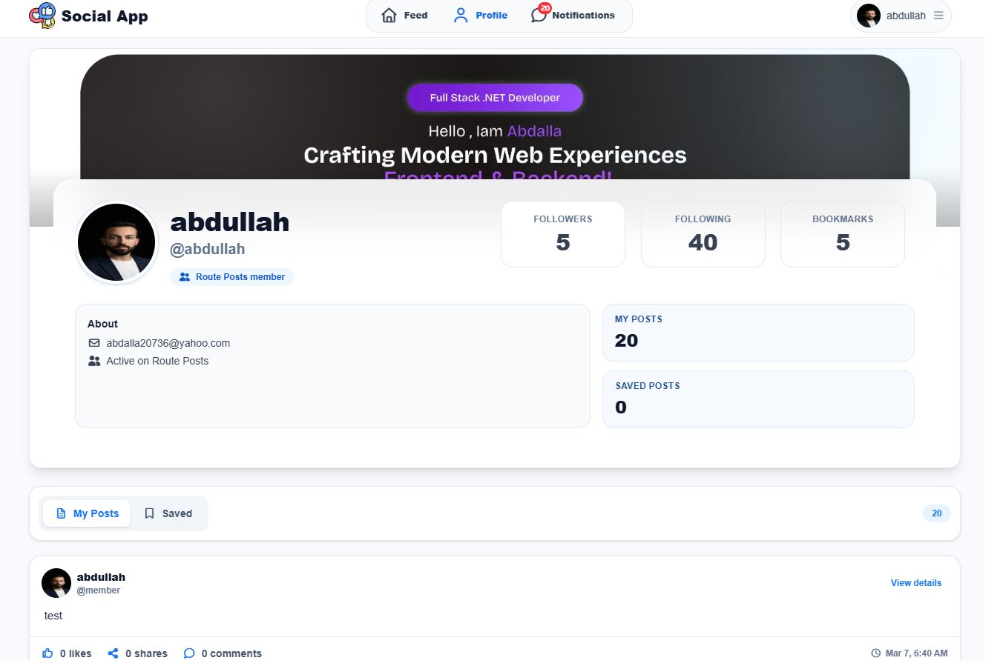
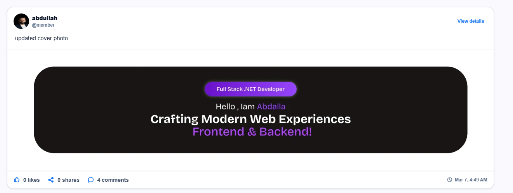
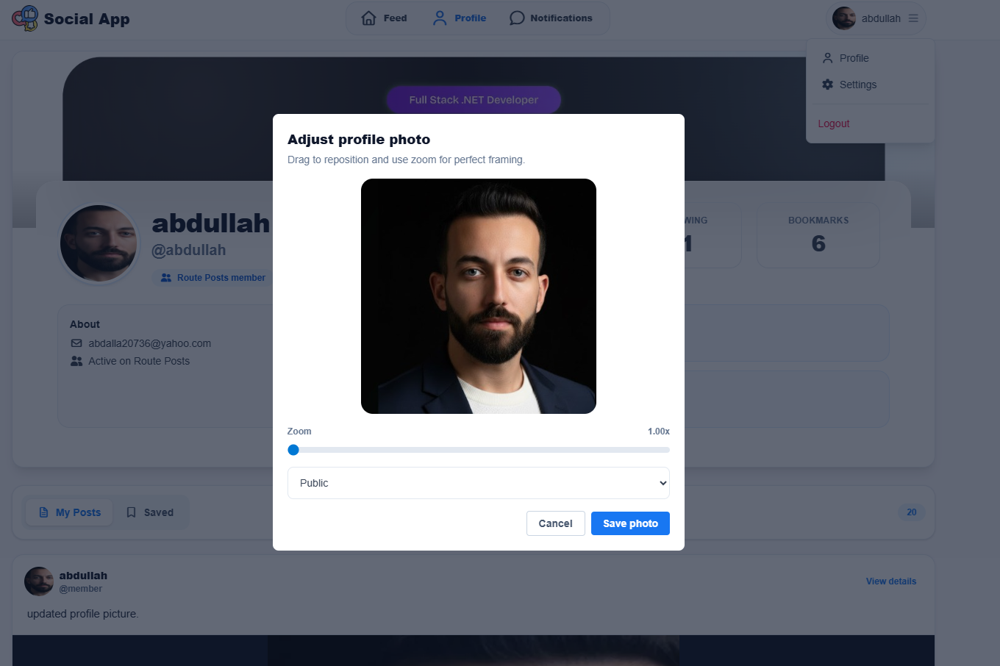
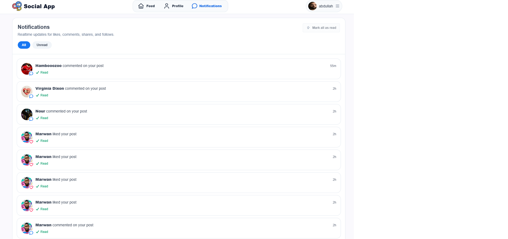
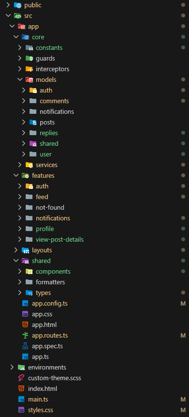

# Social App

A modern social media web application built with Angular 21 and Tailwind CSS. Users can sign up/sign in, create posts, like/comment/share content, manage profile photos, bookmark posts, and receive notifications.

## Live Demo

[View Demo](https://abdalla20736.github.io/SocialApp/)

## Tech Stack

- **Framework:** Angular 21 (standalone components)
- **Language:** TypeScript
- **Styling:** Tailwind CSS
- **Reactive Programming:** RxJS
- **Routing:** Angular Router
- **HTTP:** Angular HTTP Client
- **UI Libraries:** Font Awesome, ngx-toastr, ngx-timeago, ngx-emoji-mart
- **State Management:** RxJS Observable patterns
- **Authentication:** Cookie + Local Storage based

## Screenshots

<p align="center">
  
  
</p>

<p align="center">
  
  
</p>

<p align="center">
  
  
</p>

<p align="center">
  
  
</p>

<p align="center">
  
</p>

## Features

### Authentication

- Sign up and sign in
- Route protection with auth/guest guards
- Token + expiry handling using cookies
- Password validation

### Feed

- Home feed and suggestions
- Create, edit, delete posts
- Like and bookmark posts
- Share posts
- Privacy control (public, followers, only me)

### Comments

- Add, edit, delete, and like comments
- Reply to comments
- Nested comment threads

### Profile

- View own/other user profiles
- Update profile and cover photo
- Photo cropping and zoom adjustment
- Privacy selection for cover photo post
- User statistics (posts, followers, following)

### Notifications

- Real-time notifications
- Unread count badge
- Mark as read / mark all as read
- Notification filtering

### User Experience

- Global loading UI
- Toast notifications for user feedback
- Time-ago formatting for timestamps
- Image overlay/lightbox
- Responsive design (mobile-first)
- Smooth animations and transitions

## Project Structure

```
src/
  app/
    core/
      constants/          # App constants and validators
      guards/             # Auth and guest route guards
      interceptors/       # HTTP interceptors
      models/             # TypeScript interfaces/types
      services/           # Core services (auth, post, user, etc.)
    features/
      auth/               # Sign up, sign in, change password
      feed/               # Home feed and suggestions
      notifications/      # Notifications feature
      profile/            # User profiles
      not-found/          # 404 page
    layouts/
      auth-layout/        # Layout for auth pages
      main-layout/        # Layout for main app (navbar, sidebar)
    shared/
      components/         # Reusable components
      formatters/         # Custom formatters (timeago)
      types/              # Shared types
  environments/
    environment.ts        # Environment configuration
  styles.css              # Global styles
```

## Routing Overview

### Protected Routes (require authentication)

- `/feed` - Home Feed
- `/suggestions` - User Suggestions
- `/post/:id` - Post Details
- `/profile` - Current User Profile
- `/profile/:id` - Other User Profile
- `/notifications` - Notifications
- `/settings` - Change Password

### Public Routes (guest only)

- `/signup` - Sign Up
- `/login` - Sign In

### Error Routes

- `**` - 404 Not Found

All routes have dynamic titles configured in `src/app/app.routes.ts`.

## Getting Started

### Prerequisites

- Node.js (v18+)
- npm or yarn

### 1. Clone repository

```bash
git clone <your-repo-url>
cd SocialApp
```

### 2. Install dependencies

```bash
npm install
```

### 3. Configure environment

Update the API base URL in `src/environments/environment.ts`:

```typescript
export const environment = {
  production: false,
  baseUrl: 'https://route-posts.routemisr.com',
};
```

### 4. Run development server

```bash
npm start
```

Then open your browser and navigate to `http://localhost:4200/`

The application will automatically reload whenever you modify source files.

## Available Scripts

### Development

```bash
npm start
```

Runs the app in development mode on `http://localhost:4200/`

### Production Build

```bash
npm run build
```

Compiles and optimizes the project for production. Output is generated in `dist/` directory.

### Watch Mode

```bash
npm run watch
```

Builds in watch mode during development.

### Testing

```bash
npm test
```

Runs unit tests using Karma + Jasmine.

## Core Services

### AuthService

- User authentication (login, signup, logout)
- Token management
- Current user state management

### PostService

- CRUD operations on posts
- Like/unlike posts
- Bookmark posts
- Share posts
- Post privacy management

### CommentService

- Add, edit, delete comments
- Like/unlike comments
- Fetch comments by post

### UserService

- Fetch user profiles
- Get user posts
- Get bookmarked posts
- Update user profile

### NotificationService

- Fetch notifications
- Mark notifications as read
- Get unread count

## Authentication Flow

1. User signs up/logs in
2. Backend returns JWT token + expiry
3. Token stored in cookies (httpOnly for security)
4. Expiry timestamp stored for validation
5. User data stored in localStorage
6. Auth interceptor adds token to all requests
7. On logout, cookies and localStorage are cleared

## HTTP Interceptors

### Auth Interceptor

- Automatically adds JWT token to request headers
- Removes token if expired

### Loading Interceptor

- Shows/hides global loading spinner on requests

## Key Components

### PostCard

- Main post display component
- Handles likes, comments, shares, bookmarks
- Edit and delete operations
- Privacy controls

### ProfileUploadPictureModal

- Image cropping with zoom
- Privacy selection for cover photos
- Photo adjustment interface

### Navbar

- Navigation links
- User menu dropdown
- Notifications badge

### CommentsContainer

- Comments list display
- Comment form
- Comment editing/deletion

## Configuration & Constants

Constants are centralized in `src/app/core/constants/`:

- `validators.ts` - Validation patterns
- `app.constant.ts` - App name and title suffix

Import and use in components:

```typescript
import { APP_NAME } from '../../../core/constants/app.constants';

export class MyComponent {
  readonly APP_NAME = APP_NAME;
}
```

## API Integration

This project integrates with: `https://route-posts.routemisr.com`

Key endpoints:

- `POST /users/signup` - Register
- `POST /users/signin` - Login
- `GET /posts` - Get posts
- `POST /posts` - Create post
- `PUT /posts/:id` - Update post
- `DELETE /posts/:id` - Delete post
- `PUT /posts/:id/like` - Like/unlike post
- `PUT /posts/:id/bookmark` - Bookmark post
- `GET /comments` - Get comments
- `POST /comments` - Create comment
- `GET /notifications` - Get notifications

## Browser Support

- Chrome (latest)
- Firefox (latest)
- Safari (latest)
- Edge (latest)

## Performance Optimizations

- Lazy loading of routes
- Standalone components (no NgModules)
- OnPush change detection strategy where applicable
- Image optimization
- CSS minification with Tailwind
- Tree-shaking enabled in production builds

## Deployment

### Manual Build & Deploy

```bash
npm run build
```

Deploy `dist/social-app/browser` to your server.

### GitHub Pages

```bash
npm run build -- --base-href "/<repo-name>/"
npx angular-cli-ghpages --dir=dist/social-app/browser
```

## Development Notes

- Uses hash-based routing (`/#/path`)
- Responsive design with Tailwind CSS
- Follows Angular best practices
- Centralized error handling in services
- Toast notifications for user feedback

## Common Issues

### CORS Errors

Ensure the backend API supports your frontend origin. Check `environment.ts` baseUrl.

### Authentication Token Expired

Token expiry is validated in auth interceptor and automatically cleared.

### Images Not Loading

Verify image URLs and check `public/images/` folder permissions.

## Contributing

1. Create a feature branch
2. Make your changes
3. Test thoroughly
4. Submit a pull request

## Troubleshooting

### Port 4200 already in use

```bash
ng serve --port 4201
```

### Node modules issues

```bash
rm -rf node_modules package-lock.json
npm install
```

### Build errors

```bash
npm run build -- --configuration=development
```

## Future Enhancements

- Real-time notifications with WebSocket
- Dark mode support
- Advanced search functionality
- User mentions (@username)
- Hashtag support
- Trending section
- Video uploads
- Direct messaging

## License

This project is for educational and training purposes.

## Support

For issues, questions, or suggestions, please open an issue on GitHub.

---

**Made with ❤️ by Route Academy Students**
